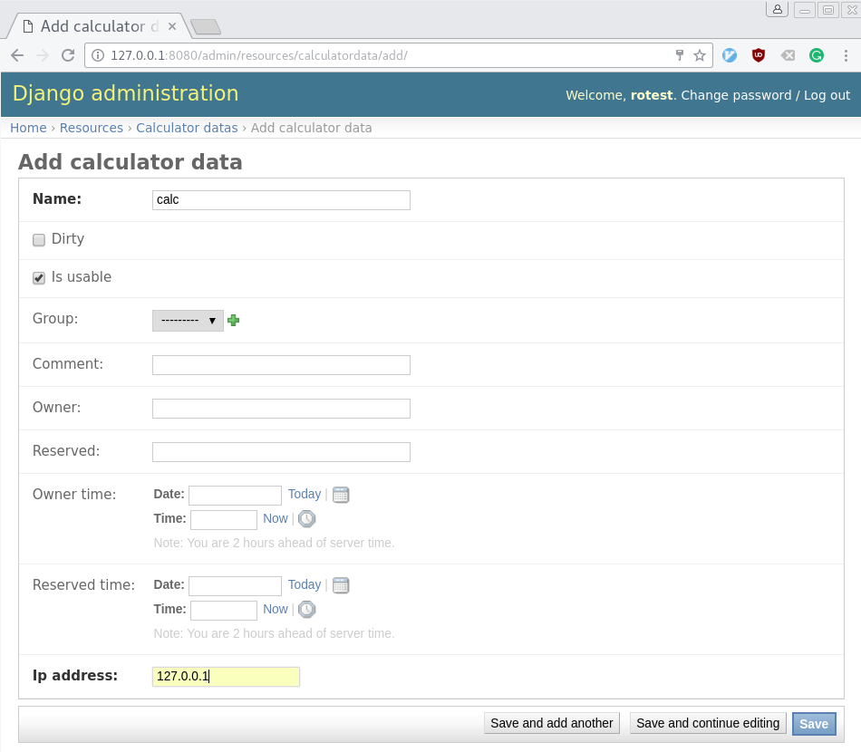

================
Adding Resources
================

The true power of Rotest is in its client-server infrastructure, which enables
writing resource-oriented tests, running a dedicated server to hold all
resources, and enabling clients run tests.

In this tutorial, you'll learn:

* How to create a resource class.
* How to run the server, that acts as a resource manager.

Creating a Resource Class
=========================

In the root of your project, create a new Django application:

.. code-block:: console

    $ django-admin startapp resources

You'll see a new directory named :file:`resources`, in the following structure:

.. code-block:: console

    .
    ├── manage.py
    ├── resources
    │   ├── admin.py
    │   ├── __init__.py
    │   ├── migrations
    │   │   └── __init__.py
    │   ├── models.py
    │   ├── tests.py
    │   └── views.py
    ├── rotest_demo
    │   ├── __init__.py
    │   ├── __init__.pyc
    │   ├── settings.py
    │   ├── settings.pyc
    │   ├── urls.py
    │   └── wsgi.py
    ├── rotest.yml
    └── test_math.py

Don't forget to add the new application as well as ``rotest`` to the
``INSTALLED_APPS`` configuration in the :file:`rotest_demo/settings.py` file:

.. code-block:: python

    ...

    INSTALLED_APPS = (
        'rotest.core',
        'rotest.management',
        'resources',
        'django.contrib.admin',
        'django.contrib.auth',
        ...
    )

We're going to write a simple resource of a calculator. Edit the
:file:`resources/models.py` file to have the following content:

.. code-block:: python

    from django.db import models
    from rotest.management.models.resource_data import ResourceData

    class CalculatorData(ResourceData):
        class Meta:
            app_label = "resources"

        ip_address = models.IPAddressField()

The :class:`CalculatorData` class is the database definition of the Calculator
resource. It defines any characteristics it has, as oppose to behaviour it may
have. It's also recommended adding it to the Django admin panel. Edit the
content of the :file:`resources/admin.py` file:

.. code-block:: python

    from rotest.management.admin import register_resource_to_admin

    from . import models

    register_resource_to_admin(models.CalculatorData, attr_list=['ip_address'])

Let's continue to write the Calculator resource, which exposes a simple
calculation action. Edit the file :file:`resources/calculator.py`:

.. code-block:: python

    import rpyc
    from rotest.management.base_resource import BaseResource

    from .models import CalculatorData

    class Calculator(BaseResource):
        DATA_CLASS = CalculatorData

        PORT = 1357

        def connect(self):
            super(Calculator, self).connect()
            self._rpyc = rpyc.classic.connect(self.data.ip_address, self.PORT)

        def finalize(self):
            super(Calculator, self).finalize()
            if self._rpyc is not None:
                self._rpyc.close()
                self._rpyc = None

        def calculate(self, expression):
            return self._rpyc.eval(expression)

Note the following:

* There is a use in the ``RPyC`` module, which can be installed using:

  .. code-block:: console

    $ pip install rpyc

* The :class:`Calculator` class inherits from
  :class:`rotest.management.base_resource.BaseResource`.

* The previously declared class :class:`CalculatorData` is referenced in this
  class.

* Two methods are used to set up and tear down the connection to the resource:
  :meth:`rotest.management.base_resource.BaseResource.connect`
  and :meth:`rotest.management.base_resource.BaseResource.finalize`.

The methods of BaseResource that can be overridden:

 * **connect()** - Always called at the start of the resource's setup process,
   override this method to start the command interface to your resource,
   e.g. setting up a SSH connection, creating a Selenium client, etc.

 * **validate()** - Called after ``connect`` if the ``skip_init`` flag was off
   (which is the default). This method should return `False` if further
   initialization is needed to set up the resource, or `True` if it is ready
   to work as it is. The default ``validate`` method always returns `False`,
   prompting the resource's initialization process after ``connect``
   (see next method).

 * **initialize()** - Called after ``connect`` if the ``skip_init`` flag was off
   (which is the default) and ``validate`` returned `False` (which is also
   the default). Override this method to further prepare the resource for work,
   e.g. installing versions and files, starting up processes, etc.

 * **finalize()** - Called when the resource is released, override this method to
   to clean temporary files, shut down processes, destroy the remote connection,
   etc.

 * **store_state(state_dir_path)** - Called after the teardown of a test, but only
   if ``save_state`` flag was on (which is `False` by default) and the test
   ended in an error or a failure. The directory path which is passed to this
   method is a dedicated folder inside the test's working directory.
   Override this method to create a snapshot of the resource's state for
   debugging purposes, e.g. copying logs, etc.

Running the Resource Management Server
======================================

First, let's initialize the database with the following Django commands:

.. code-block:: console

    $ python manage.py makemigrations
    Migrations for 'resources':
      0001_initial.py:
        - Create model CalculatorData
    $ python manage.py migrate
    Operations to perform:
      Apply all migrations: core, management, sessions, admin, auth, contenttypes, resources
    Running migrations:
      Applying contenttypes.0001_initial... OK
      Applying auth.0001_initial... OK
      Applying admin.0001_initial... OK
      Applying management.0001_initial... OK
      Applying management.0002_auto_20150224_1427... OK
      Applying management.0003_add_isusable_and_comment... OK
      Applying management.0004_auto_20150702_1312... OK
      Applying management.0005_auto_20150702_1403... OK
      Applying management.0006_delete_projectdata... OK
      Applying management.0007_baseresource_group... OK
      Applying management.0008_add_owner_reserved_time... OK
      Applying management.0009_initializetimeoutresource... OK
      Applying management.0010_finalizetimeoutresource... OK
      Applying management.0011_refactored_to_resourcedata... OK
      Applying management.0012_delete_previous_resources... OK
      Applying core.0001_initial... OK
      Applying core.0002_auto_20170308_1248... OK
      Applying management.0013_auto_20170308_1248... OK
      Applying resources.0001_initial... OK
      Applying sessions.0001_initial... OK

The first command creates a migrations file, that orders changing the database
schemas or contents. The second command changes the database according to
those orders. If the database does not already exist, it creates it.

Let's run the Rotest server, using the :program:`rotest server` command:

.. program:: rotest server

.. code-block:: console

    $ rotest server

    Performing system checks...

    System check identified no issues (0 silenced).
    May 23, 2018 - 20:05:28
    Django version 1.7.11, using settings 'rotest_demo.settings'
    Starting development server at http://0.0.0.0:8000/
    Quit the server with CONTROL-C.

Adding a Resource on Django Admin Panel
=======================================

To sum this up, let's add a Calculator resource. Run the `createsuperuser`
command to get access to the admin panel:

.. code-block:: console

    $ python manage.py createsuperuser
    Username (leave blank to use 'user'): <choose a user in here>
    Email address: <choose your email address>
    Password: <type in your password>
    Password (again): <type password again>
    Superuser created successfully.

Now, Just enter the Django admin panel (via `<http://127.0.0.1:8000/admin>`_),
access it using the above credentials, and add a resource with the name
``calc`` and a local IP address like ``127.0.0.1``:

    Adding a resource via Django admin
